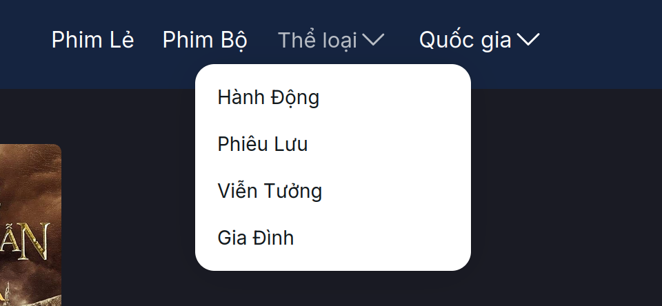
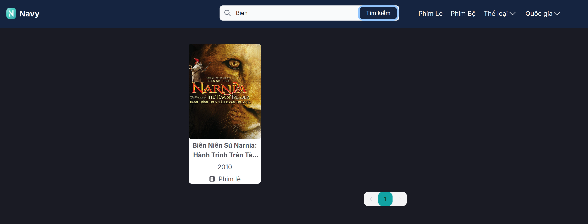
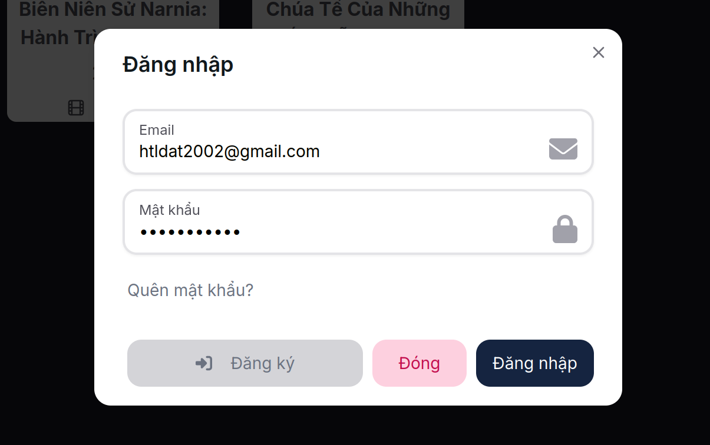

# Interfaces
    Homepage Screenshot


    Filter Screenshot


    Search Screenshot


    Login Screenshot


    Movie Screenshot


# How to run the project (Install docker first)

👉 **Step 1: Pull images from Docker Hub**
```bash
docker compose -f docker-compose.prod.yml pull
```

# 2.pull image development/production enviroment
docker compose -f docker-compose.dev.yml pull
docker compose -f docker-compose.prod.yml pull

# 3.run development/production enviroment
docker compose -f docker-compose.dev.yml up
docker compose -f docker-compose.prod.yml up

# clean dangling image
docker image prune

# clear all of docker
docker system prune -a --volumes -f