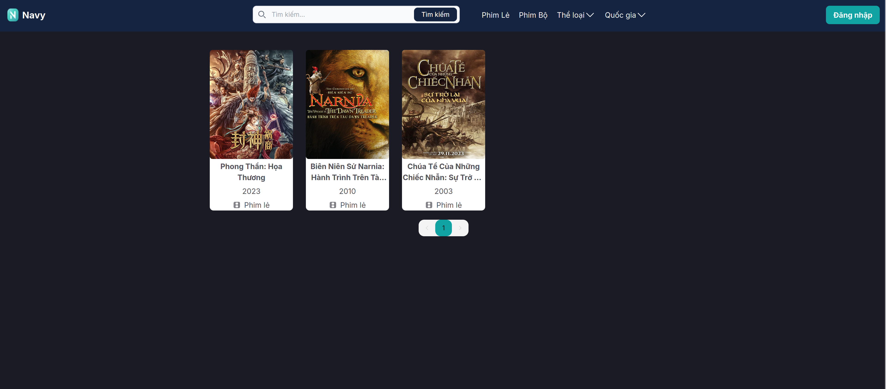

# Interfaces
    Homepage Screenshot
    

# 1.build images
DOCKER_BUILDKIT=1 docker compose -f docker-compose.yml build

# 2.pull image development/production enviroment
docker compose -f docker-compose.dev.yml pull
docker compose -f docker-compose.prod.yml pull

# 3.run development/production enviroment
docker compose -f docker-compose.dev.yml up
docker compose -f docker-compose.prod.yml up

# clean dangling image
docker image prune

# clear all of docker
docker system prune -a --volumes -f